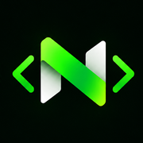
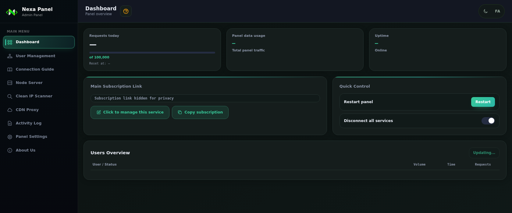
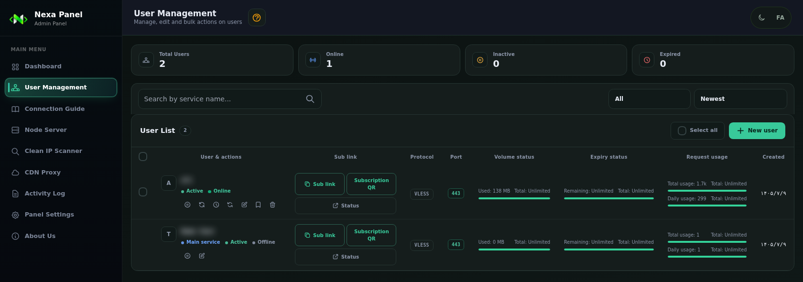

# NEXA Panel

### A bilingual control panel running on your Cloudflare account

Manage users, usage, routing and panel operations in one place—without maintaining a separate server.

**[🚀 Deploy NEXA](https://www.irnexateam.workers.dev/deploy/)** · [📚 Documentation](https://irnexateam.github.io/nexa-panel/) · [🌐 Website](https://www.irnexateam.workers.dev/) · [💻 GitHub](https://github.com/irnexateam/nexa-panel)

[📣 Telegram](https://t.me/irnexateam) · [▶ YouTube](https://www.youtube.com/@irnexateam)

<strong> English</strong> &nbsp;|&nbsp; <a href="README.fa.md"> فارسی</a>

---

## Overview

**NEXA Panel** is a Persian/English management panel hosted on your own Cloudflare Worker and D1 database. It brings service management, connection guidance, CDN proxy routing, clean-IP scanning, activity logs and operational controls into a single interface.

> NEXA runs in your Cloudflare account; Cloudflare plan limits, quotas and terms continue to apply.

## Highlights

### Manage and monitor
- See Worker request usage, panel traffic, uptime, the main subscription and quick controls from the dashboard.
- Create and manage services with data, expiry and request limits; choose TLS or non-TLS ports; copy subscription links and QR codes; edit, suspend, reset or remove services.
- Find services with search and filters, use bulk actions, and review clear volume and expiry indicators.

### Connect and route
- Use built-in connection guides for Android, iPhone, Windows and macOS, plus main-node configs for supported TLS ports.
- Test Cloudflare edge addresses with the clean-IP scanner. Copy/add results are plain IPv4 addresses without a port, and individual results can be saved to the panel pool while a scan is running.
- Choose Smart, Proxy All or Direct CDN routing. Manage PROXYIP entries with health checks, cleanup and the public proxy finder. Saved entries remain available to shared routing and service configs; per-user overrides are optional.

### Operate and protect
- Review activity logs and optionally send Telegram notifications.
- Update the panel; configure routes and config names; manage domain and adult-content filters and Cloudflare API settings.
- Change the admin password and create or restore JSON backups.

## Screenshots

  
  &nbsp;
  

## Deployment

The official deployment page is the installation method documented for NEXA Panel.

  <a href="https://www.irnexateam.workers.dev/deploy/"><strong>👉 Open the NEXA deployment page</strong></a>

Follow the prompts to create a Cloudflare API token, enter it in the deployment portal, choose your account and panel name, and monitor deployment progress. The portal provisions the required Cloudflare resources and displays the resulting access details.

> **Protect your token:** Treat the Cloudflare API token like a password. Enter it only in the official deployment portal—never commit it or include it in screenshots, issues or documentation. For later releases, use **Panel Settings → Update Panel**.

## Documentation and community

The bilingual guide covers deployment and the panel’s major areas, from user management and routing to logs, backups and security settings.

-  [browse the documentation on GitHub](https://github.com/irnexateam/nexa-panel/tree/main/docs).
- Switch between English and Persian with the **EN/FA** control.
- Follow [Telegram](https://t.me/irnexateam) and [YouTube](https://www.youtube.com/@irnexateam) for updates and guides.

## License

NEXA Panel is released under the [MIT License](LICENSE).
